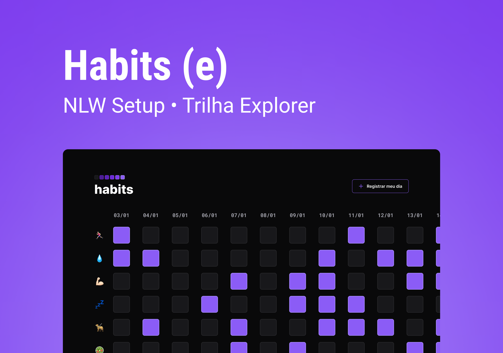

<h1 align="center">
  Habit Tracker 🟪
</h1>

  <a href="#-layout">Layout</a>&nbsp;&nbsp;&nbsp;|&nbsp;&nbsp;&nbsp;
  <a href="#-tecnologias">Tecnologias</a>&nbsp;&nbsp;&nbsp;|&nbsp;&nbsp;&nbsp;
  <a href="#-projeto">Projeto</a>&nbsp;&nbsp;&nbsp;|&nbsp;&nbsp;&nbsp;
  <a href="#-licença">Licença</a>&nbsp;&nbsp;&nbsp;|&nbsp;&nbsp;&nbsp;
  <a href="#-contato">Contato</a>

 

## 🎨 Layout

Aqui você pode conferir o layout em suas respectivas versões.  

[👉 Link para visualizar a pagina inteira](https://projeto-habits-explorer.vercel.app/)

### Versão Web 🖥️

 
   

---

## 🚀 Tecnologias

Esse projeto foi desenvolvido com as seguintes tecnologias:

 
 
 

## 💻 Projeto

Habit Tracker, uma ferramenta de acompanhamento de hábitos para o usuário colocar em prática suas resoluções e metas, ou seja, registrar ações e acompanhar a evolução dos novos hábitos que deseja colocar na sua rotina. 

Desenvolvido apenas com HTML, SASS e JavaScript durante trilha Explorer NLW Setup...

## 📝 Licença

Esse projeto está sob a licença MIT. Veja o arquivo [LICENSE](LICENSE) para mais detalhes.

## 🌐 Contato

 

---

Feito com ♥ by Gabriel Gonçalves 🖖 &nbsp;&nbsp;&nbsp;|&nbsp;&nbsp; <a href="#--habit-tracker-">Voltar para o Inicio ⬆️ </a>